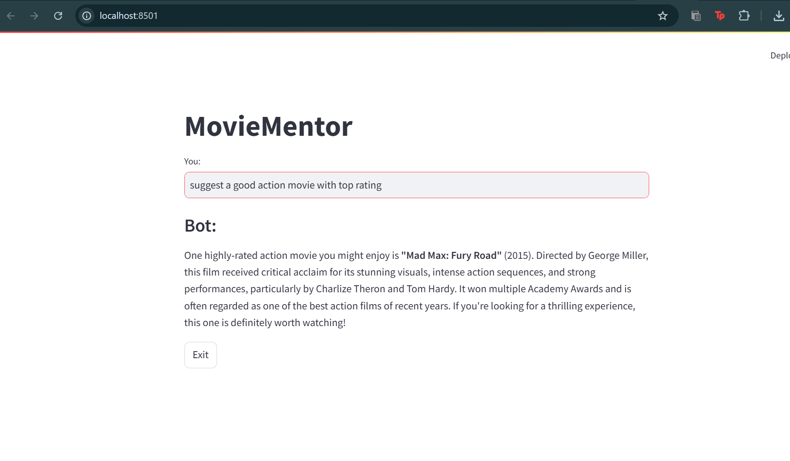

# MovieMentor
Chatbot for Movie recommendation

# Movie Mentor Chatbot

Movie Mentor is an AI-driven chatbot designed to recommend movies based on user input. It integrates with MongoDB to store and fetch movie data, and uses OpenAI's GPT-based model to generate responses. The chatbot provides recommendations and interacts with users in a conversational manner, offering a personalized experience.


## Project Overview

This project is divided into several modules:
- **Movie Search**: Uses MongoDB to search for movie data based on the user's query.
- **Chatbot Interaction**: Powered by OpenAI's GPT-4 model (via the LangChain API), it generates responses and provides movie recommendations.
- **Interaction Logging**: Stores the user’s input, chatbot responses, and movie recommendations in a MongoDB database.
- **User Interface**: A simple interface to interact with the chatbot and get movie suggestions.

## Requirements

Before running the project, ensure you have the following dependencies installed:

- **Python 3.8+**
- **MongoDB Atlas** account (for hosting the movie database and logging interactions)
- **OpenAI API Key** (for accessing GPT models)

### Install Dependencies

You can install the required libraries by running the following:

```bash
pip install -r requirements.txt


